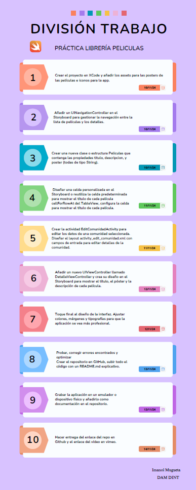
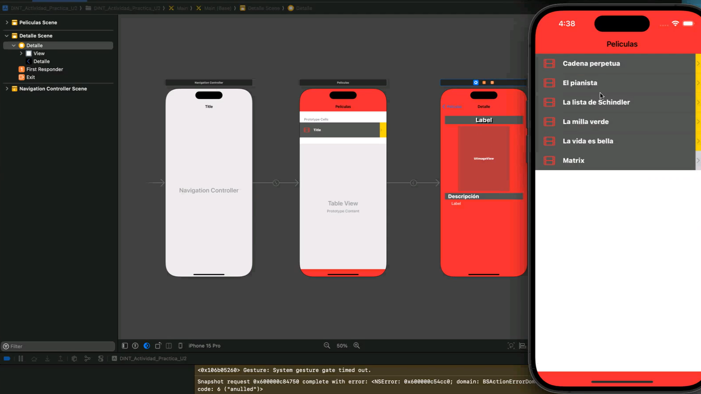

# MovieApp-iOS

Una aplicación iOS desarrollada en Swift y UIKit como parte de una 
actividad práctica. Esta app muestra una lista de películas y permite ver 
los detalles de cada película en una pantalla separada.

## Características

- **Lista de Películas**: Muestra una lista de títulos de películas en un 
`UITableView`.
- **Vista de Detalles**: Al seleccionar una película, se abre una vista de 
detalle que muestra el título, la imagen del póster y la descripción.
- **Navegación**: Uso de `UINavigationController` para transiciones entre 
vistas.
- **Diseño Responsivo**: Implementación de `constraints` 
para adaptar la interfaz a diferentes tamaños de pantalla.

## Estructura del Proyecto

- **ViewController.swift**: Controlador de la pantalla principal que 
muestra la lista de películas.
- **DetalleViewController.swift**: Controlador de la pantalla de detalles 
que muestra el título, póster y descripción de la película seleccionada.
- **Peliculas.swift**: Estructura de datos para representar cada película 
con su título, descripción y nombre de imagen del póster.

## Instalación

1. Clona este repositorio en tu máquina local.
    ```bash
    git clone https://github.com/kodebidean/MovieApp-iOS.git
    ```
2. Abre `MovieApp-iOS.xcodeproj` en Xcode.
3. Ejecuta la aplicación en un simulador o dispositivo físico.

## División del Trabajo
<a href="DivisionTrabajo_iOS.pdf" target="_blank">
    
</a>

## Demostración en Video

<a href="https://vimeo.com/1029713810?share=copy#t=0" target="_blank">
    
</a>

## Créditos

Desarrollado por Imanol Mugueta
